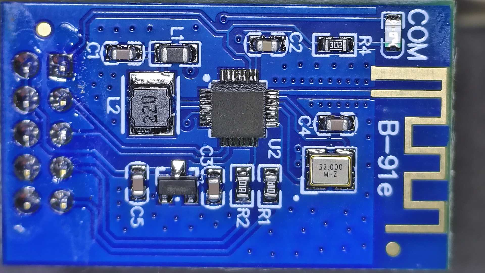

Controlling PSG9080 signal generator through the included bluetooth module.

The module that came with the signal generator have the chips deleted, but apparently it is a `JDY-31 SPP` or similar.

The board is connected to the TTL Communication Extension Port of the PSG9080 (see page 20 of [manual](doc/PSG9080_EN_manual.pdf) - http://68.168.132.244/PSG9080_EN_manual.pdf).
The serial protocol is indicated in the "[PSG Communication Protocol.pdf](doc/PSG Communication Protocol.pdf)" included in http://68.168.132.244/PSG9080_EN_Setup.zip.

Testing the received commands using the official closed android [app](http://68.168.132.244/APP/JDS8000.apk):

